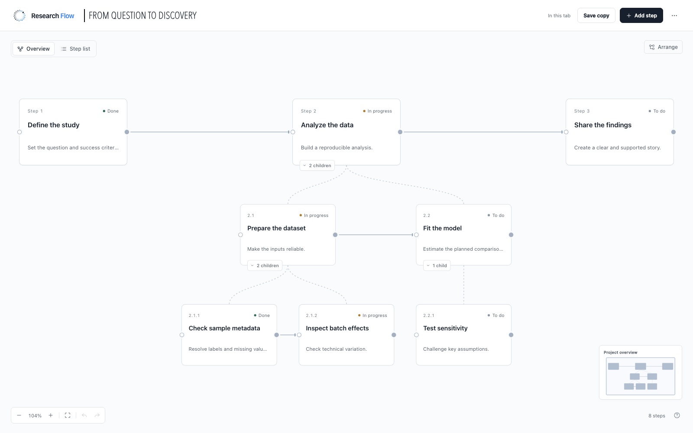

# Research Flow

**A clear view of your research, from action to completion.**

Research Flow is a visual planner for a single research project. Connect steps,
organize them into branches, and keep your workflow in a readable YAML file on your
own machine or Linux server.



## Features

- **Canvas editing** — arrange, connect, rename, and delete steps directly on the canvas.
- **Nested branches** — organize numbered steps and children, with an indented list view.
- **Focus and overview** — zoom into a branch or navigate the whole project with the minimap.
- **Details in one place** — track each step's status, goals, notes, inputs, and outputs.
- **Undo and redo** — revisit changes as your plan evolves.
- **Your files, your workflow** — save to YAML with previous-version backups and protection against conflicting edits.

## Quick start

Requires **Python 3.10+** and [pipx](https://pipx.pypa.io/stable/installation/).

```bash
pipx install https://github.com/SpicyChicken6/research-flow/releases/download/v0.8.5/research_flow-0.8.5-py3-none-any.whl
pipx ensurepath
```

Reopen your terminal if needed, then launch from your research folder:

```bash
cd ~/research/my-study
research-flow
```

Open the private URL printed in the terminal. Keep the app running and click
**Save** to write your changes to the selected YAML file.

- **One YAML/YML file in the folder:** opens it.
- **No YAML files:** asks before creating `workflow.yaml` (default: No).
- **Several YAML files:** choose one with `research-flow --project ./my-study.yaml`.

Existing files must be valid Research Flow workflows.

### Working on a remote server?

In VS Code Remote-SSH, enable [integrated browser remote access](docs/install.md#open-inside-vs-code-over-remote-ssh),
then open the printed URL with **Browser: Open Integrated Browser**. No manual port
forwarding is needed with this setup. Your changes save to the YAML on the server.

See the [installation and VS Code guide](docs/install.md) for setup and upgrades,
or the [Linux guide](docs/linux.md) for persistent services and troubleshooting.

[Download releases](https://github.com/SpicyChicken6/research-flow/releases) · [Security and privacy](SECURITY.md)
